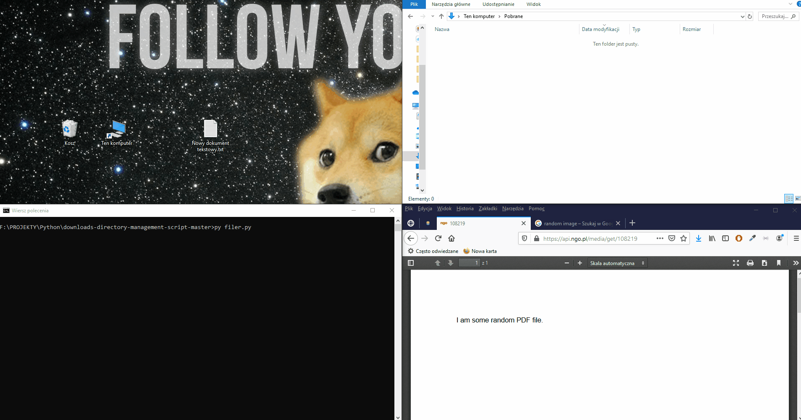

# Project Name
> Filer

## Table of contents
* [General info](#general-info)
* [Screenshots](#screenshots)
* [Technologies](#technologies)
* [Setup](#setup)

## General info
Filer is a script that help with directory managemet. It detects changes in the downloads directory and moves file to the right directory.

## Screenshots


## Technologies
* Python 3.8.0
* watchdog

## Setup
```

$ py filer.py


```